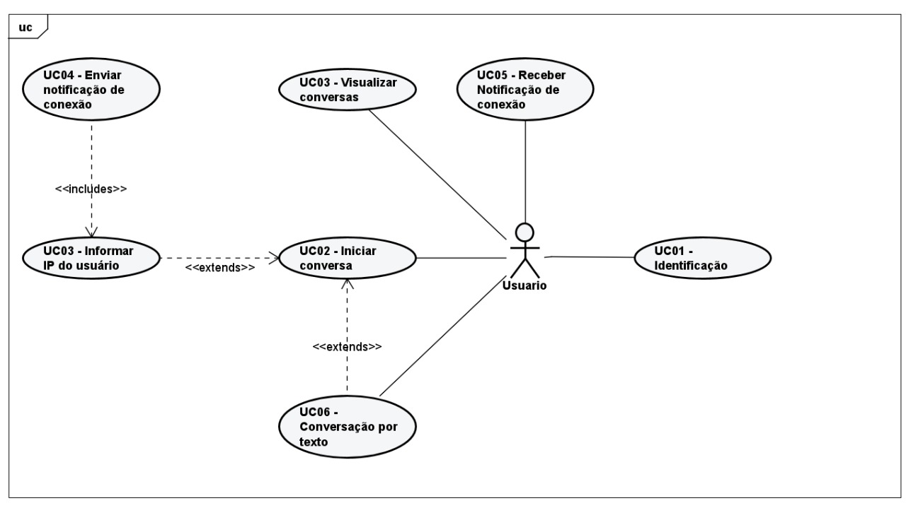
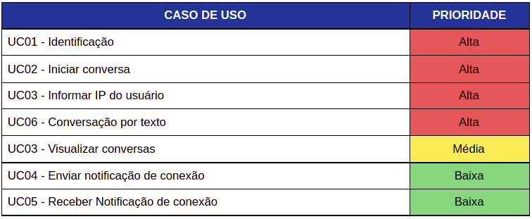
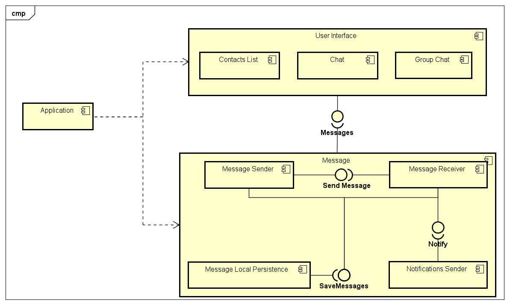
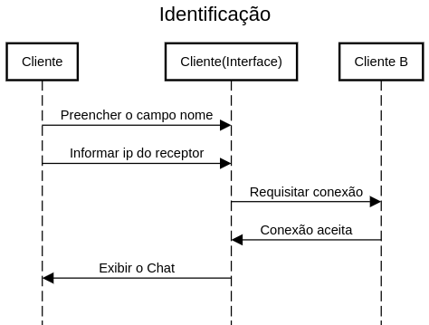
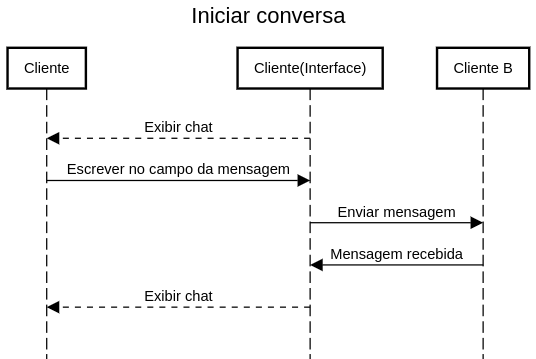
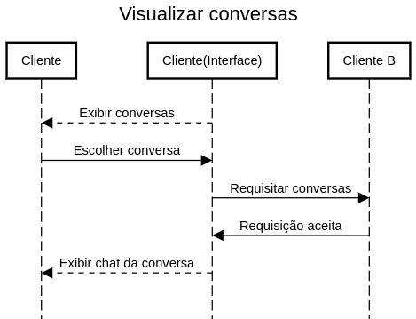

# Chat-Application

Foi proposto que fizémos uma aplicação de chat no componente curricular de Redes de Computadores. A aplicação deveria ser obrigatoriamente implementada utilizando API de sockets (TCP ou UDP).

# Sumário
1. [Tecnologia](#tecnologia)
2. [Compilação](#compilação)
3. [Atores](#atores)
4. [Casos de uso](#casosdeuso)
5. [Componentes](#componentes)
6. [Diagramas de sequência](#diagramas)
7. [Protocolo](#protocolo)

## 🚀 Tecnologia 

Esse projeto foi desenvolvido com as seguintes tecnologias:

- [Flutter](https://flutter.dev/): Framework para desenvolvimento multiplataforma
- [Dart](https://dart.dev/): Linguagem de programação
- [Provider](https://pub.dev/packages/provider): Biblioteca para gerenciamento de estados da aplicação

Dart foi a linguagem de programação utilizada para desenvolver o produto proposto. Em conjunto com a linguagem  será utilizado o framework Flutter para que seja possível o desenvolvimento de uma interface Desktop, disponível para o sistema operacional Windows, onde o usuário do sistema terá acesso às funcionalidades. Como protocolo da camada de transporte será utilizado TCP já que o mesmo em comparação com UDP oferece mais confiabilidade na entrega de datagramas, o que é de suma importância para uma aplicação de chat de conversa.

## Compilação 
OBS. esta aplicação foi desenvolvida apenas para máquinas com o sistema operacional Windows.

1. Siga os passos de instalação do Framework Flutter clicando [aqui](https://flutter.dev/docs/get-started/install).
2. [Clone esse repositório](https://help.github.com/en/articles/cloning-a-repository) com git no terminal do SO com o comando `git clone https://github.com/ecorreas/Chat-Application.git`.
3. Após o clone do repositório, abra o projeto clonado no **VS Code**.
4. Instale as dependências executando o comando `flutter packages get` ou `flutter pub get` no terminal dentro do seu diretório do projeto (provavelmente `afd_system`).
5. Abra apartir do terminal a pasta localizada em "/lib/app/mock/"
6. Execute o seguinte comando `dart run create_server.dart` para executar o servidor
6. Por fim volte ao VSCode e execute o comando `flutter run` ou aperte F5 (modo debug) para executar o app desktop.

## Atores 

  

<em>Figura 1. Diagrama de casos de uso</em>

## Casos de uso 
A Tabela 1 apresenta os casos de usos de forma priorizada, onde os casos de uso definidos com prioridade alta deverão ser apresentados na versão final do produto desenvolvido diferentemente dos casos de uso com prioridade média e baixa que poderão ou não ser apresentados na entrega final do produto.

  

<em>Tabela 1. Priorização de casos de uso</em>

## Componentes 

  

<em>Figura 2. Diagrama de componentes</em>

## Diagramas de sequência 
### UC01-Identificação ###

  

<em>Figura 3. Diagrama de sequência do UC01-Identificação</em>

### UC02-Iniciar conversa ###

  

<em>Figura 4. Diagrama de sequência do UC02-Iniciar conversa</em>

### UC03-Visualizar conversas ###

  

<em>Figura 5. Diagrama de sequência do UC03-Visualizar conversas</em>

## Protocolo 
<table style="border-collapse:collapse;border-spacing:0;table-layout: fixed; width: 516px" class="tg"><colgroup><col style="width: 97px"><col style="width: 155px"><col style="width: 131px"><col style="width: 133px"></colgroup><thead><tr><th style="border-color:inherit;border-style:solid;border-width:1px;font-family:Arial, sans-serif;font-size:14px;font-weight:bold;overflow:hidden;padding:4px 3px;text-align:center;vertical-align:top;word-break:normal" colspan="2">ClienteA</th><th style="border-color:inherit;border-style:solid;border-width:1px;font-family:Arial, sans-serif;font-size:14px;font-weight:bold;overflow:hidden;padding:4px 3px;text-align:center;vertical-align:top;word-break:normal" colspan="2">ClienteB</th></tr></thead><tbody><tr><td style="border-color:inherit;border-style:solid;border-width:1px;font-family:Arial, sans-serif;font-size:14px;font-weight:bold;overflow:hidden;padding:4px 3px;text-align:left;vertical-align:top;word-break:normal">Request</td><td style="border-color:black;border-style:solid;border-width:1px;font-family:Arial, sans-serif;font-size:14px;font-weight:bold;overflow:hidden;padding:4px 3px;text-align:left;vertical-align:top;word-break:normal">Mensagem</td><td style="border-color:inherit;border-style:solid;border-width:1px;font-family:Arial, sans-serif;font-size:14px;font-weight:bold;overflow:hidden;padding:4px 3px;text-align:left;vertical-align:top;word-break:normal">Response</td><td style="border-color:inherit;border-style:solid;border-width:1px;font-family:Arial, sans-serif;font-size:14px;font-weight:bold;overflow:hidden;padding:4px 3px;text-align:left;vertical-align:top;word-break:normal">Mensagem</td></tr><tr><td style="border-color:inherit;border-style:solid;border-width:1px;font-family:Arial, sans-serif;font-size:14px;font-weight:bold;overflow:hidden;padding:4px 3px;text-align:left;vertical-align:top;word-break:normal">connect()</td><td style="border-color:black;border-style:solid;border-width:1px;font-family:Arial, sans-serif;font-size:14px;overflow:hidden;padding:4px 3px;text-align:left;vertical-align:top;word-break:normal">iniciar conexão</td><td style="border-color:inherit;border-style:solid;border-width:1px;font-family:Arial, sans-serif;font-size:14px;font-weight:bold;overflow:hidden;padding:4px 3px;text-align:left;vertical-align:top;word-break:normal">get()</td><td style="border-color:inherit;border-style:solid;border-width:1px;font-family:Arial, sans-serif;font-size:14px;overflow:hidden;padding:4px 3px;text-align:left;vertical-align:top;word-break:normal">receber mensagem</td></tr><tr><td style="border-color:inherit;border-style:solid;border-width:1px;font-family:Arial, sans-serif;font-size:14px;font-weight:bold;overflow:hidden;padding:4px 3px;text-align:left;vertical-align:top;word-break:normal">write()</td><td style="border-color:black;border-style:solid;border-width:1px;font-family:Arial, sans-serif;font-size:14px;overflow:hidden;padding:4px 3px;text-align:left;vertical-align:top;word-break:normal">enviar mensagem</td><td style="border-color:inherit;border-style:solid;border-width:1px;font-family:Arial, sans-serif;font-size:14px;overflow:hidden;padding:4px 3px;text-align:left;vertical-align:top;word-break:normal"></td><td style="border-color:inherit;border-style:solid;border-width:1px;font-family:Arial, sans-serif;font-size:14px;overflow:hidden;padding:4px 3px;text-align:left;vertical-align:top;word-break:normal"></td></tr></tbody></table>
